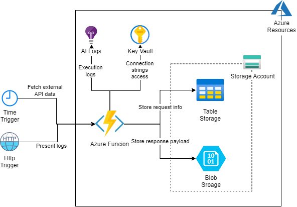
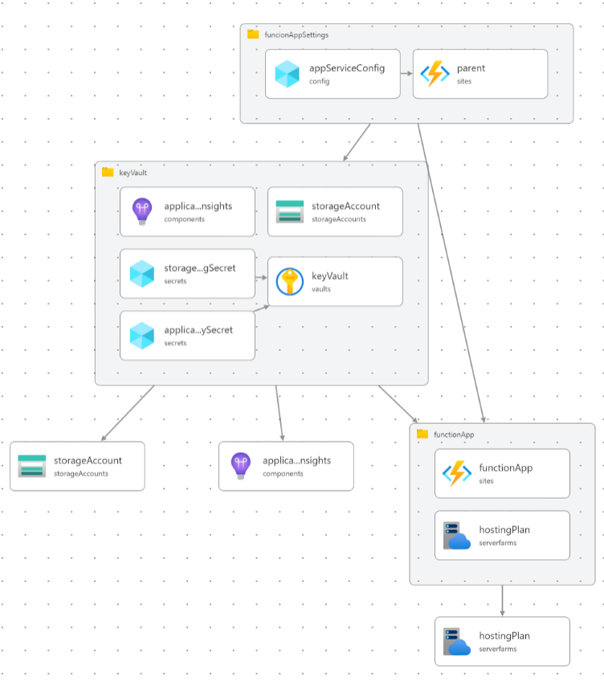

# IncreDevo recruitment task - Log API calls

This is my attempt at solving a recruitment task for the [IncreDevo company](https://incredevo.com/)

## Task description

Must use:

- Azure Function (Cloud/Local)
- Azure Storage (Cloud /Local storage emulator)
  - Table
  - Blob
- .Net Core 6

Achieve:

- Every minute, fetch data from <https://api.publicapis.org/random?auth=null> and store success/failure attempt log in the table and full payload in the blob.
- Create a GET API call to list all logs for the specific time period (from/to)
- Create a GET API call to fetch a payload from blob for the specific log entry
- Publish code on GitHub (public)

## Solution

Description of my solution to the presented problem.

### Architecture

#### IoC

I've used [Bicep](https://learn.microsoft.com/en-us/azure/azure-resource-manager/bicep/overview) to define IoC. The IoC approach allows me to have documented and consistent infrastructure.
I've chosen Bicep technology as it's easy to run from any environment that has access to Azure.

The Bicep code can be found in the [infrastructure](infrastructure) directory.

The Bicep resource and module dependencies diagram looks as follows:

### Time tracking

For time tracking I'm using [Clockify](https://clockify.me/) and I'm tracking time for each task using GitHub issues.  
I'll add the final time report when I finish the task.

### Solution showcase

_This section content will be added when I finish the implementation_

### Notes

Noteworthy decisions and aspects of the implementation and project configuration or work methodology.

_WIP_
