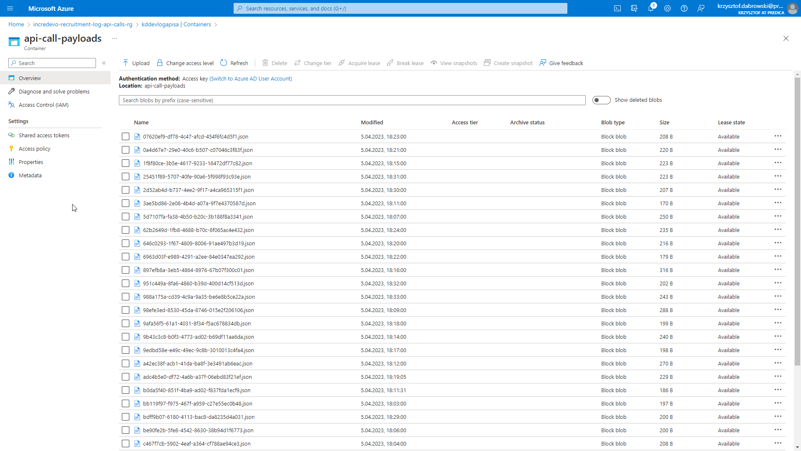
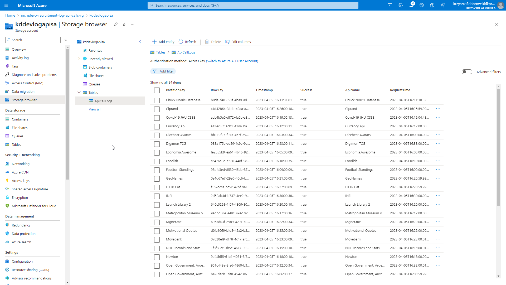
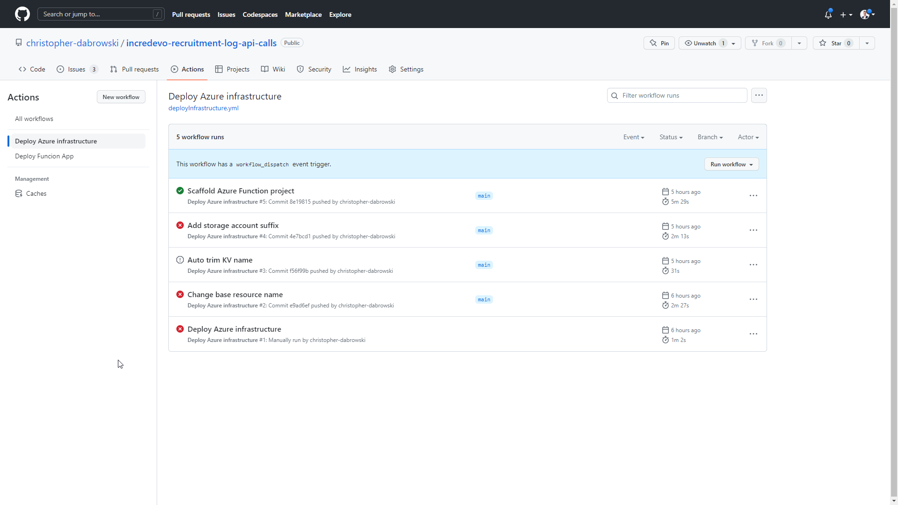
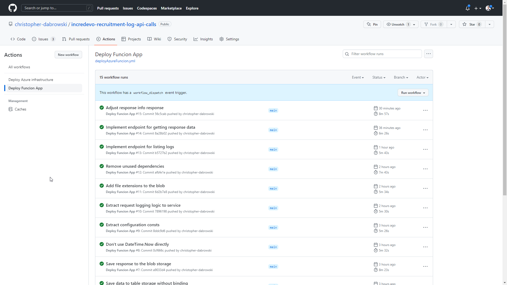

# IncreDevo recruitment task - Log API calls

This is my attempt at solving a recruitment task for the [IncreDevo company](https://incredevo.com/)

## Table of Contents

- [Table of Contents](#table-of-contents)
- [Task description](#task-description)
- [Solution](#solution)
  - [Architecture](#architecture)
    - [IoC](#ioc)
  - [Time tracking](#time-tracking)
  - [CI/CD](#cicd)
  - [Solution showcase](#solution-showcase)
    - [Listing logs](#listing-logs)
    - [Fetching specific response](#fetching-specific-response)
    - [Storage account data](#storage-account-data)
    - [GitHub Action runs](#github-action-runs)
  - [Notes](#notes)

## Task description

Must use:

- Azure Function (Cloud/Local)
- Azure Storage (Cloud /Local storage emulator)
  - Table
  - Blob
- .Net Core 6

Achieve:

- Every minute, fetch data from <https://api.publicapis.org/random?auth=null> and store success/failure attempt log in the table and full payload in the blob.
- Create a GET API call to list all logs for the specific time period (from/to)
- Create a GET API call to fetch a payload from blob for the specific log entry
- Publish code on GitHub (public)

## Solution

Description of my solution to the presented problem.

### Architecture

#### IoC

I've used [Bicep](https://learn.microsoft.com/en-us/azure/azure-resource-manager/bicep/overview) to define IoC. The IoC approach allows me to have documented and consistent infrastructure.
I've chosen Bicep technology as it's easy to run from any environment that has access to Azure.

The Bicep code can be found in the [infrastructure](infrastructure) directory.

The Bicep resource and module dependencies diagram looks as follows:

### Time tracking

For time tracking I'm using [Clockify](https://clockify.me/) and I'm tracking time for each task using GitHub issues.  

Total time spent on project: 07:25:05

Time breakdown per task:  
_format: \#{gh-issue} {name} - {time spent}_

- #1 Setup repo - 00:30:29
- #2 Write down tasks - 00:06:25
- #3 Create architecture diagram - 00:25:18
- #4 Prepare IoC - 00:18:14
- #5 CI/CD for IoC - 01:09:32
- #6 Create basic Azure Funcion - 00:05:05
- #7 CI/CD for Azure Funcion - 00:12:24
- #8 Explore api - 00:08:00
- #12 Add Swagger - 00:07:49
- #9 Store API call logs in table and blob - 02:07:06
- #10 Endpoint for all log list - 01:39:21
- #13 Describe final solution - 00:37:07

### CI/CD

To implement an automated deployment process I've used GitHub Actions.  
Specific actions are triggered when changes are pushed to a specific repository path or can be triggered manually.  
Actions definitions can be found in the [.github/workflows](.github/workflows) directory.

### Solution showcase

Azure Funcion is deployed to the Azure. I've also added the [Swagger API description](https://kd-dev-log-api-func.azurewebsites.net/api/swagger/ui) for easy exploration of the endpoints.

#### Listing logs

This is how using the ListLogs endpoint looks in action.

#### Fetching specific response

This is how using the responses endpoint looks in action.

#### Storage account data

#### GitHub Action runs

The runs can be viewed in the [Actions repo tab](https://github.com/christopher-dabrowski/incredevo-recruitment-log-api-calls/actions)

### Notes

Noteworthy decisions and aspects of the implementation and project configuration or work methodology.

- I've decided to use the access policy Key Vault permission model instead of RBAC. I've more experience with the access policies, but if I were to develop the project further I'd consider migration to the RBAC model.
- I've configured commit sighing with GPG key this ensures that commits were written by me and marks them as _verified_
- I've decided to isolated azure function process for running my app. This gives me grater control over the execution of the code and enables the runtime to be different from the hosting AF runtime
- If I would develop the solution more I'd configure project precompilation with ReadyToRun build setting to reduce cold start time
- I've experienced major issues when using the Azure Table Storage output binding. After struggling a while I decided to use the `Azure.Data` explicite clients instead of the funcion bindings
